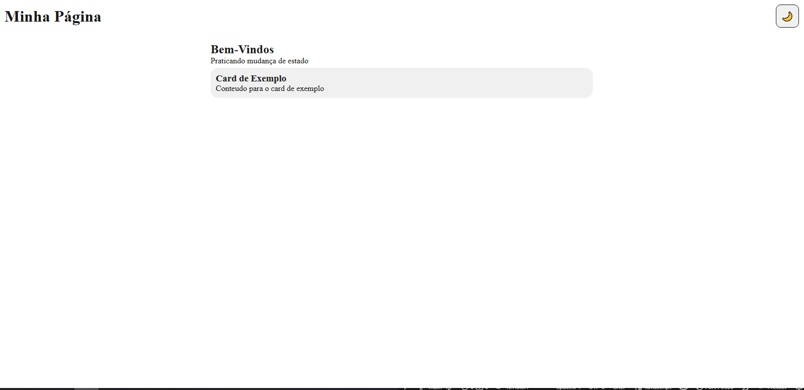
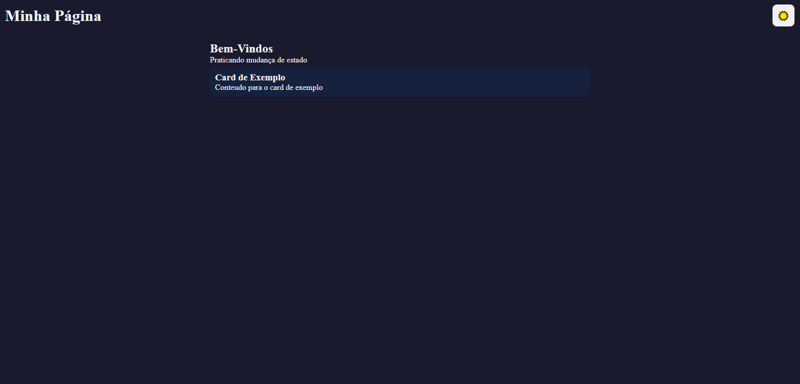

# 🌙 Tema Dark/Light

Página web com alternância entre tema claro e escuro, com preferência salva no navegador.

---

## 📸 Screenshots

| Tema Claro ☀️ | Tema Escuro 🌙 |
|---------------|----------------|
|  |  |

---

## 🚀 Funcionalidades

- Alternância entre tema claro e escuro com um clique
- Ícone do botão muda conforme o tema ativo (☀️ / 🌙)
- Preferência de tema salva no navegador via localStorage
- Tema mantido ao recarregar a página

---

## 🛠️ Tecnologias utilizadas

- HTML5
- CSS3 (Variáveis CSS e classList)
- JavaScript (ES6+)

---

## 💡 Conceitos praticados

- Variáveis CSS com `--nome` e `var()`
- `:root` para variáveis globais
- `classList.toggle`, `classList.contains` e `classList.add`
- `localStorage.setItem` e `localStorage.getItem`
- Separação de responsabilidades — JS controla estado, CSS controla visual

---

## 📦 Como executar

1. Clone o repositório:
```bash
git clone https://github.com/Dougiiee/projetoEstados
```

2. Acesse a pasta do projeto:
```bash
cd NOME-DO-REPO
```

3. Abra o arquivo `index.html` no navegador.

> Não é necessário instalar nenhuma dependência.

---

## 👨‍💻 Autor

Feito por **Douglas Laureano** — [LinkedIn](https://www.linkedin.com/in/douglas-laureano-dg/) · [GitHub](https://github.com/Dougiiee)
